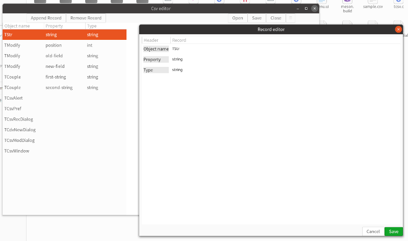

# tcsv -- Csv file Editor

## What is this?

`tcsv` is a csv file editor.
Csv file is a comma separated two dimensional text file.
There's a detailed explanation in [doc.md](doc.md).

- The first line is a header.
- Each element delimited by commas are called field.
Each line has the same number of fields.
- The second line and after are called records.

'tcsv' can show a csv file as a two dimensional table.
It can edit a record.
It can restructure the fields.
For further information, see [doc.md](doc.md).

## License

TCsv is free; you can redistribute it and/or modify it under the terms of the GNU General Public License
as published by the Free Software Foundation; either version 3 of the License, or (at your option) any later version.

It is distributed in the hope that it will be useful,
but WITHOUT ANY WARRANTY; without even the implied warranty of MERCHANTABILITY or FITNESS FOR A PARTICULAR PURPOSE.
See the [GNU General Public License](https://www.gnu.org/licenses/gpl-3.0.html) for more details.

## Feature

- Uses GTK4 and the main widget is GtkColumnView.
- Reads/writes a csv file.
- Edits a record of the csv data.
- Creates a new csv file.
- Changes the fields of a csv data.

## Document

- [Document](doc.md)

## Compile

Prerequisites.

- Gtk4
- Glib 2.68.0 or later

Compiling and installation.

~~~
$ meson _build
$ ninja -C _build
$ sudo ninja -C _build install
~~~

Execution.

~~~
$ tcsv
~~~

